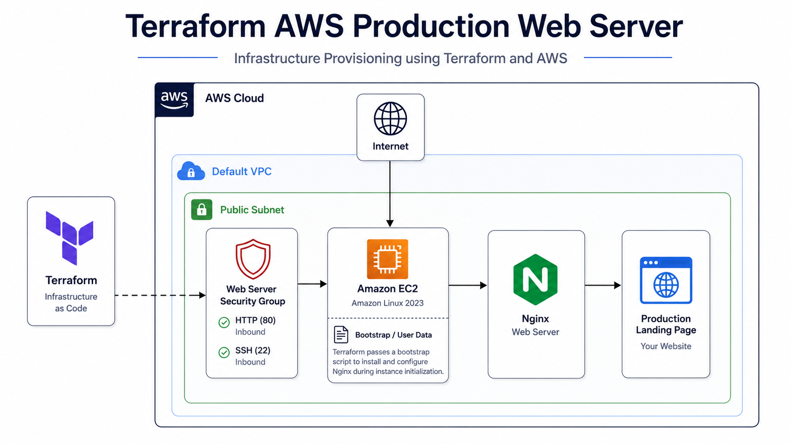
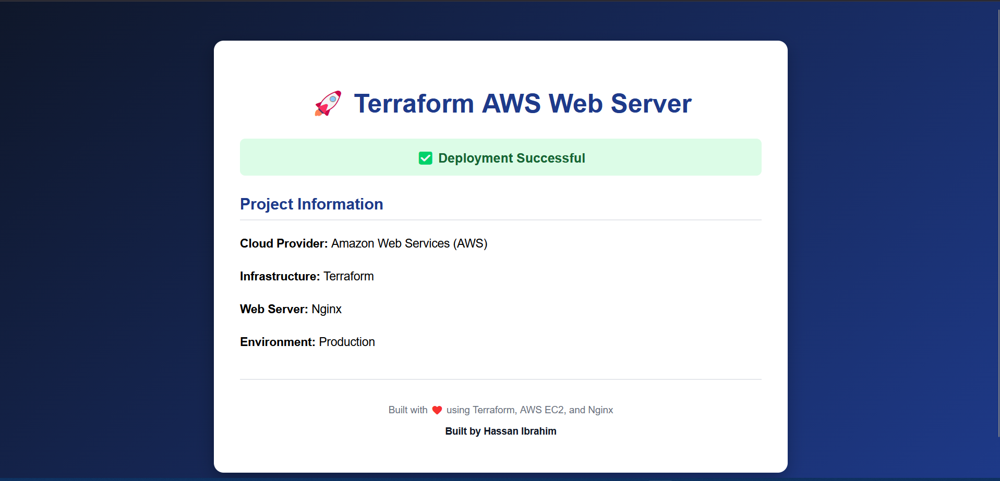

# 🚀 Terraform AWS Production Web Server

## 📌 Project Overview

This project provisions a production-ready web server on **Amazon Web Services (AWS)** using **Terraform**.

The infrastructure automatically deploys an **Amazon Linux 2023 EC2 instance** inside the AWS **Default VPC**, configures a **Security Group**, installs **Nginx** using **User Data**, and deploys a custom landing page.

The project follows **Infrastructure as Code (IaC)** best practices and is designed to be reusable, maintainable, and suitable for learning real-world Terraform deployments.

---

# Architecture

```text
                    Internet
                        │
                        ▼
                Security Group
             (HTTP 80 / SSH 22)
                        │
                        ▼
          Amazon EC2 (Amazon Linux 2023)
                        │
                 User Data Script
                        │
                        ▼
                 Install Nginx
                        │
                        ▼
             Custom HTML Landing Page
```

---

# Technologies Used

* Terraform
* Amazon EC2
* Amazon Linux 2023
* AWS Default VPC
* AWS Security Groups
* Nginx
* Bash (User Data)

---

# Project Structure

```text
.
├── versions.tf
├── provider.tf
├── variables.tf
├── terraform.tfvars
├── data.tf
├── security.tf
├── compute.tf
├── userdata.sh
├── outputs.tf
├── .gitignore
├── README.md
└── screenshots
    └── website.png
```

---

# Features

✔ Infrastructure as Code (IaC)

✔ Automated EC2 provisioning

✔ Dynamic Amazon Linux 2023 AMI lookup

✔ AWS Default VPC integration

✔ Configurable Availability Zone

✔ Automatic Nginx installation

✔ Automatic website deployment using User Data

✔ Terraform Outputs

✔ Reusable variables

✔ Clean and maintainable project structure

---

# Prerequisites

* Terraform v1.6 or later
* AWS CLI configured
* AWS Account
* IAM User with sufficient permissions

---

# Deployment

### Initialize Terraform

```bash
terraform init
```

### Validate the configuration

```bash
terraform validate
```

### Format Terraform files

```bash
terraform fmt
```

### Review the execution plan

```bash
terraform plan
```

### Deploy the infrastructure

```bash
terraform apply
```

### Display outputs

```bash
terraform output
```

### Destroy the infrastructure

```bash
terraform destroy
```

---

# Architecture

The following diagram illustrates the infrastructure deployed by Terraform.



---

# Website Preview

The following screenshot shows the deployed Nginx landing page running on Amazon EC2.



---

# Learning Objectives

This project demonstrates knowledge of:

* Infrastructure as Code (IaC)
* AWS EC2
* Amazon Linux 2023
* AWS Default VPC
* Security Groups
* User Data Automation
* Nginx Web Server
* Terraform Variables
* Terraform Outputs
* Terraform Data Sources
* Terraform Best Practices

---

# Future Improvements

* Application Load Balancer (ALB)
* Auto Scaling Group (ASG)
* Launch Template
* Route 53
* AWS Certificate Manager (ACM)
* CloudWatch Monitoring
* Remote Backend (S3 + DynamoDB)
* CI/CD Pipeline with GitHub Actions

---

# Author

**Hassan Ibrahim**

Cloud Engineer

AWS Certified Cloud Practitioner

AWS Certified Solutions Architect – Associate

GitHub: https://github.com/HassanIbrahim33

LinkedIn: https://linkedin.com/in/hassan-ibrahim-000026395
